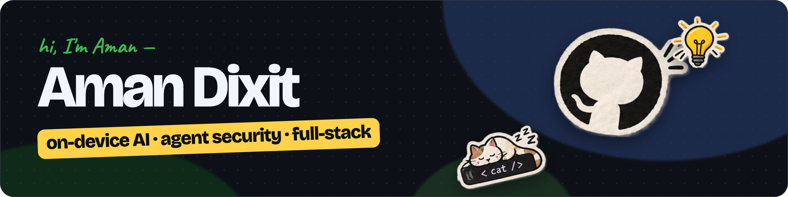

CS undergrad at MITS Gwalior (B.Tech, 2027) and former AI intern at Parallel Pictures.
I build on-device AI and security tooling for AI agents: software that has to be trustworthy, not just work.
Looking for software engineering and AI engineering roles: 2027 internships and new-grad positions.

### Featured

**[WATCHER](https://github.com/Aaman-911/watcher)** · prompt-injection defence for browsing agents 
Deterministic detection flagged 18/18 adversarial runs with 0 false positives on matched clean pages. Zero-dependency core, 22 test suites with CI on every push, and a Chrome MV3 extension (WATCHER Shield). 
Node.js · Chrome Extensions (MV3) · GitHub Actions

**[SANKET](https://github.com/Aaman-911/SANKET-HACKSYNAPSE)** · two-way Indian Sign Language terminal · hackathon winner 
Each camera frame becomes 543 landmarks, classified on-device by a BiGRU trained on 4,800 self-recorded clips; a 3D avatar signs the staff's reply back. 
TypeScript · React · TensorFlow.js · ONNX Runtime Web · MediaPipe · Three.js

**[Mark Killer](https://github.com/Aaman-911/mark-killer)** · Chrome MV3 extension for Gemini's visible watermark 
Reverses the alpha blend exactly, for images and for Veo video decoded and re-encoded locally with WebCodecs. Nothing is uploaded. 
JavaScript · WebCodecs · OffscreenCanvas

**[HireUS](https://github.com/Aaman-911/hireus)** · AI mock interviewer, built with Kumar Shivam 
Adaptive questions for your role and level, voice or typed answers, a Gemini-scored report on four metrics, and live job matches from Adzuna. 
React 19 · Express 5 · Gemini API · Web Speech API

### Experience

**AI Intern, Parallel Pictures** (June 2026, remote): automated the studio's end-to-end AI video production with Veo 3, Nano Banana, Omni Flash and ElevenLabs, and wrote the SOPs that made the workflow team-wide.

### Recognition

Smart India Hackathon 2025 finalist · Special Award at two national-level hackathons · NPTEL certified in Cloud Computing

### Stack

TypeScript · JavaScript · Python · C++ 
React · Next.js · Node.js · Express · MongoDB 
TensorFlow.js · ONNX Runtime Web · MediaPipe · Three.js · Gemini API 
Chrome Extensions (MV3) · GitHub Actions · Vercel

### Contact

[itsaman911@gmail.com](mailto:itsaman911@gmail.com) · [LinkedIn](https://www.linkedin.com/in/aman-dixit-68a5b8299)
