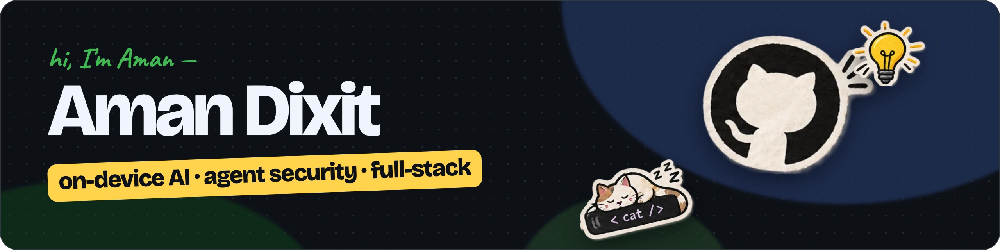
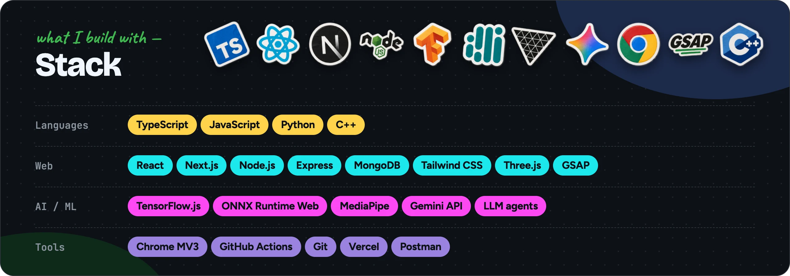
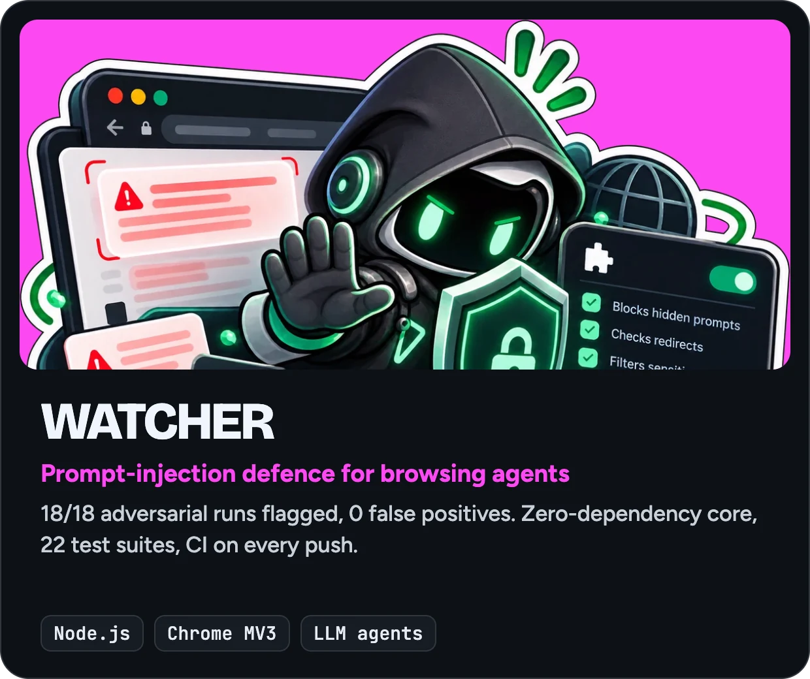
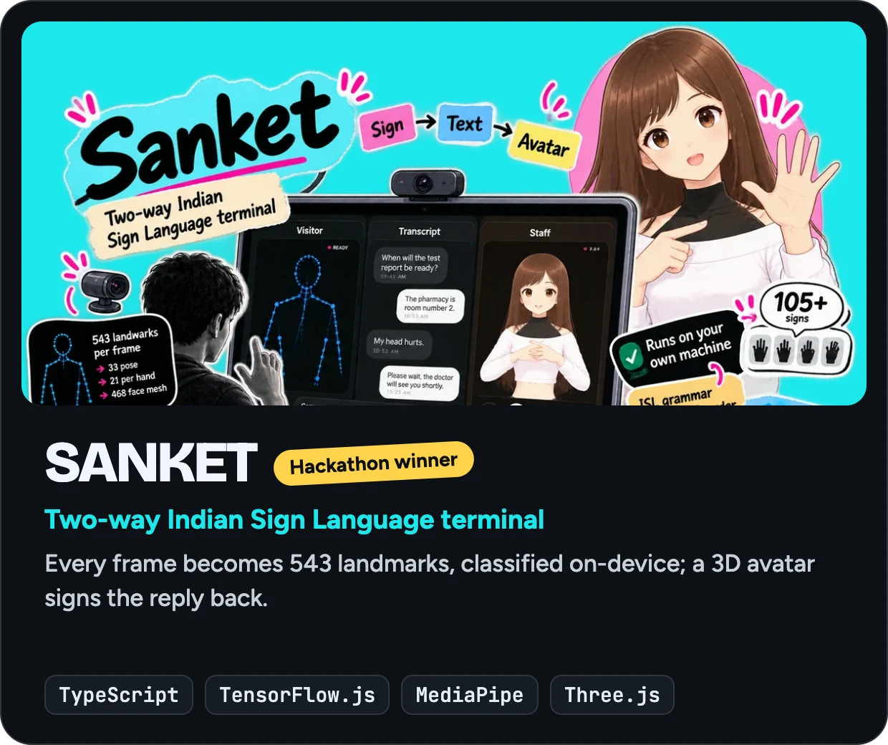
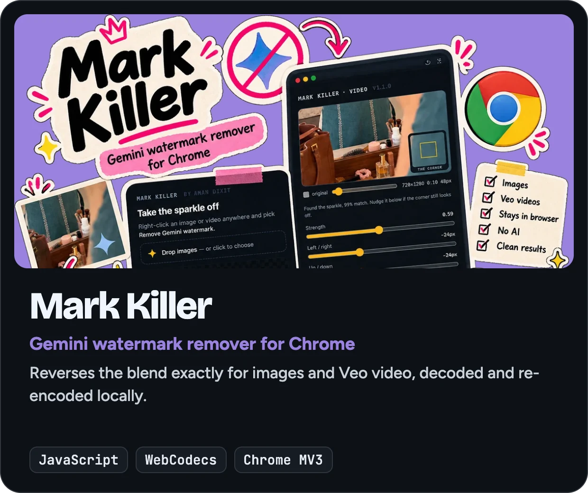
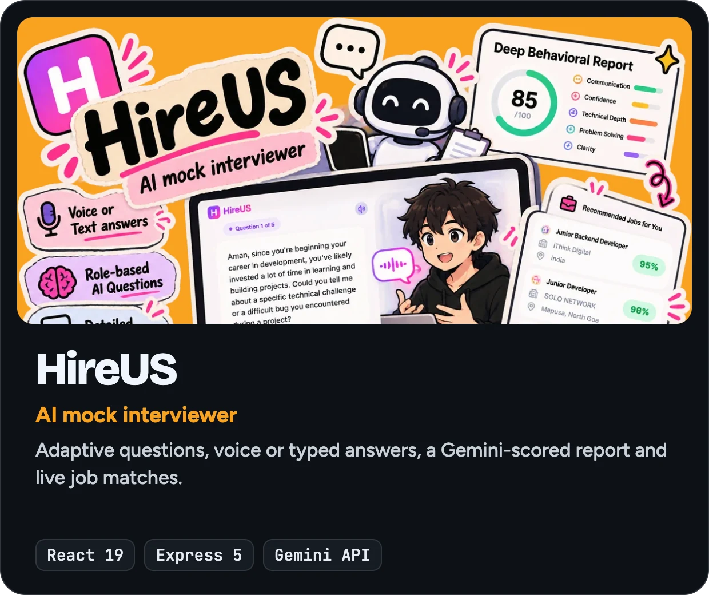

&nbsp;
&nbsp;

### About

CS undergrad at MITS Gwalior (B.Tech, 2027) and former AI intern at Parallel Pictures. 
I build on-device AI and security tooling for AI agents: software that has to be trustworthy, not just work. 
Looking for software engineering and AI engineering roles: 2027 internships and new-grad positions.

 

### Selected work

### Experience

**AI Intern, Parallel Pictures** (June 2026, remote): automated the studio's end-to-end AI video production with Veo 3, Nano Banana, Omni Flash and ElevenLabs, and wrote the SOPs that made the workflow team-wide.

### Recognition

Smart India Hackathon 2025 finalist · Special Award at two national-level hackathons · NPTEL certified in Cloud Computing
